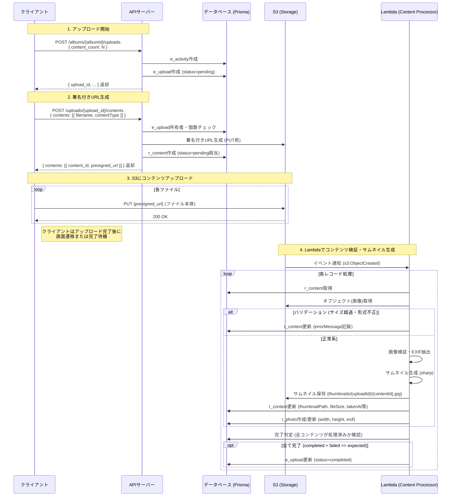

# コンテンツアップロードフロー（実装ベース）

現在の実装に基づいたアップロード処理のシーケンス図です。

## 概要

1. **アップロード開始**: クライアントがアルバムを指定してアップロードセッションを作成します。
2. **署名付きURL生成**: アップロードするファイル情報（ファイル名、MIMEタイプ）を送信し、S3へのアップロード用URLを取得します。
3. **S3アップロード**: クライアントが直接S3へファイルをアップロードします。
4. **非同期処理**: S3への保存をトリガーにLambdaが起動し、検証、サムネイル生成、DB更新を行います。

## シーケンス図

## 補足: データモデル関係

- **e_upload**: アップロードセッション。`photoCount`, `videoCount` で期待するファイル数を保持。
- **r_content**: 個々のコンテンツ。Lambda処理完了時に `thumbnailPath` がセットされることで「完了」とみなされる。エラー時は `errorMessage` がセットされる。
- **r_photo**: 写真のメタデータ（EXIF, サイズなど）。`contentId` と 1:1 で紐づく。
