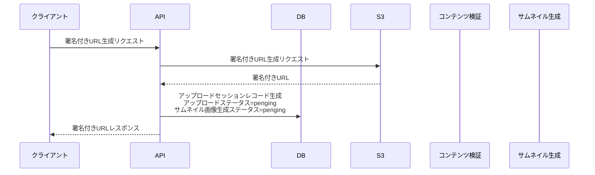
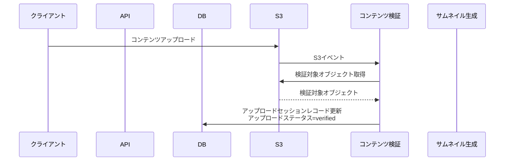
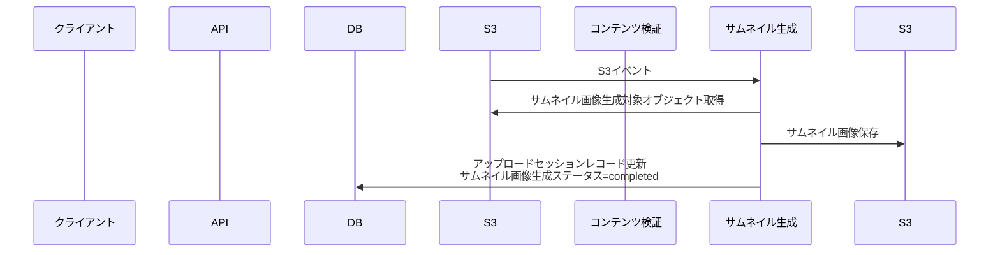

# コンテンツアップロード処理概要

## 署名付きURLの生成・取得

```mermaid
sequenceDiagram
    participant client as クライアント
    participant api as API
    participant db as DB
    participant s3 as S3
    participant content_verifier as コンテンツ検証
    participant thumbnail_generator as サムネイル生成

    client->>api: 署名付きURL生成リクエスト
    api->>s3: 署名付きURL生成リクエスト
    s3-->>api: 署名付きURL
    api->>db: アップロードセッションレコード生成<br>アップロードステータス=penging<br>サムネイル画像生成ステータス=penging
    api-->>client: 署名付きURLレスポンス
```

## コンテンツのアップロードと検証

```mermaid
sequenceDiagram
    participant client as クライアント
    participant api as API
    participant db as DB
    participant s3 as S3
    participant content_verifier as コンテンツ検証
    participant thumbnail_generator as サムネイル生成

    client->>s3: コンテンツアップロード
    s3->>content_verifier: S3イベント
    content_verifier->>s3: 検証対象オブジェクト取得
    s3-->>content_verifier: 検証対象オブジェクト
    content_verifier->>db: アップロードセッションレコード更新<br>アップロードステータス=verified
```

## サムネイル生成

```mermaid
sequenceDiagram
    participant client as クライアント
    participant api as API
    participant db as DB
    participant s3 as S3
    participant content_verifier as コンテンツ検証
    participant thumbnail_generator as サムネイル生成

    s3->>thumbnail_generator: S3イベント
    thumbnail_generator->>s3: サムネイル画像生成対象オブジェクト取得
    thumbnail_generator->>S3: サムネイル画像保存
    thumbnail_generator->>db: アップロードセッションレコード更新<br>サムネイル画像生成ステータス=completed
```
